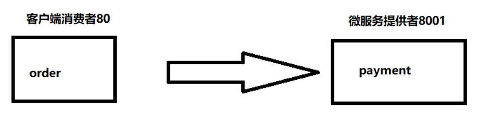

[toc]


# SpringCloud

> 学习springcloud， 参考B站尚硅谷，侵删。

详细的版本依赖[查看](https://start.spring.io/actuator/info)


## 支付模块



> 浏览器无法直接发送post，可以选用postman测试。
>
> 开发阶段可以采用热部署，上线就不要了


## 消费者模块


## cloud-api-commons

* 抽取公共代码

别的`module`要引用只需要在`pom.xml`中引入依赖即可

```xml
<!-- 引入自己定义的api通用包，可以使用Payment支付Entity -->
        <dependency>
            <groupId>com.codewater.com.codewater.com.codewater.springcloud</groupId>
            <artifactId>cloud-api-commons</artifactId>
            <version>${project.version}</version>
        </dependency>
```


## 服务注册中心


### Eureka


#### 架构


* dubbo

  

  


#### 集群


服务中心互相观察

1. 搭建

   

2. 需要本机的`hosts`文件

   

   

3. 成功（注意看地址栏），也不会爆红了

   

   

   

4. 支付模块也搭一个集群


